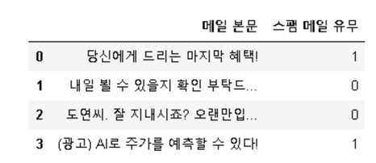

- 머신 러닝 모델을 학습시키고 평가하기 위해서는 데이터를 적절하게 분리하는 작업이 필요
# 1. 지도 학습(Supervised Learning)
- 지도 학습의 훈련 데이터는 정답이 무엇인지 맞춰 하는 '문제'에 해당되는 데이터와 레이블이라고 부르는 '정답'이 적혀있는 데이터로 구성

# 2. X와 y분리하기
## 1) zip 함수를 이용하여 분리하기
- zip()함수는 동일한 개수를 가지는 시퀀스 자료형에서 각 순서에 등장하는 원소들끼리 묶어주는 역할
```
X, y = zip(['a', 1], ['b', 2], ['c', 3])
print('X 데이터 :',X)
print('y 데이터 :',y)

[output]
X 데이터 : ('a', 'b', 'c')
y 데이터 : (1, 2, 3)
```
```
# 리스트의 리스트 또는 행렬 또는 뒤에서 배울 개념인 2D 텐서.
sequences = [['a', 1], ['b', 2], ['c', 3]]
X, y = zip(*sequences)
print('X 데이터 :',X)
print('y 데이터 :',y)

[output]
X 데이터 : ('a', 'b', 'c')
y 데이터 : (1, 2, 3)
```
## 2) 데이터프레임을 이용하여 분리하기
```
values = [['당신에게 드리는 마지막 혜택!', 1],
['내일 뵐 수 있을지 확인 부탁드...', 0],
['도연씨. 잘 지내시죠? 오랜만입...', 0],
['(광고) AI로 주가를 예측할 수 있다!', 1]]
columns = ['메일 본문', '스팸 메일 유무']

df = pd.DataFrame(values, columns=columns)
df
```

- 데이터프레임은 열의 이름으로 각 열에 접근이 가능하므로, 이를 이용하면 손쉽게 X 데이터와 y 데이터를 분리가능
```
X = df['메일 본문']
y = df['스팸 메일 유무']

print('X 데이터 :',X.to_list())
print('y 데이터 :',y.to_list())

[output]
X 데이터 : ['당신에게 드리는 마지막 혜택!', '내일 뵐 수 있을지 확인 부탁드...', '도연씨. 잘 지내시죠? 오랜만입...', '(광고) AI로 주가를 예측할 수 있다!']
y 데이터 : [1, 0, 0, 1]
```
## 3) Numpy를 이용하여 분리하기
- 임의의 데이터를 만들어서 Numpy의 슬라이싱(slicing)을 사용하여 데이터를 분리
```
np_array = np.arange(0,16).reshape((4,4))
print('전체 데이터 :')
print(np_array)

[output]
전체 데이터 :
[[ 0  1  2  3]
 [ 4  5  6  7]
 [ 8  9 10 11]
 [12 13 14 15]]
```
- 마지막 열을 제외하고 X데이터에 저장합니다. 마지막 열만을 y데이터에 저장
```
X = np_array[:, :3]
y = np_array[:,3]

print('X 데이터 :')
print(X)
print('y 데이터 :',y)

[output]
X 데이터 :
[[ 0  1  2]
 [ 4  5  6]
 [ 8  9 10]
 [12 13 14]]
y 데이터 : [ 3  7 11 15]
```
# 3. 테스트 데이터 분리하기
- 이미 X와 y가 분리된 데이터에 대해서 테스트 데이터를 분리하는 과정
## 1) 사이킷 런을 이용하여 분리하기
```
X_train, X_test, y_train, y_test = train_test_split(X, y, test_size= 0.2, random_state=1234)

X : 독립 변수 데이터. (배열이나 데이터프레임)
y : 종속 변수 데이터. 레이블 데이터.
test_size : 테스트용 데이터 개수를 지정한다. 1보다 작은 실수를 기재할 경우, 비율을 나타낸다.
train_size : 학습용 데이터의 개수를 지정한다. 1보다 작은 실수를 기재할 경우, 비율을 나타낸다.
random_state : 난수 시드
```
- 임의로 X 데이터와 y 데이터를 생성
```
# 임의로 X와 y 데이터를 생성
X, y = np.arange(10).reshape((5, 2)), range(5)

print('X 전체 데이터 :')
print(X)
print('y 전체 데이터 :')
print(list(y))

[output]
X 전체 데이터 :
[[0 1]
 [2 3]
 [4 5]
 [6 7]
 [8 9]]
y 전체 데이터 :
[0, 1, 2, 3, 4]
```
- train_test_split()은 기본적으로 데이터의 순서를 섞고나서 훈련 데이터와 테스트 데이터를 분리
- random_state의 값을 특정 숫자로 기재해준 뒤에 다음에도 동일한 숫자로 기재해주면 항상 동일한 훈련 데이터와 테스트 데이터 얻을 수 있음
- 값을 변경하면 다른 순서로 섞인 채 분리되므로 이전과 다른 훈련 데이터와 테스트 데이터
- random_state 값을 임의로 1234로 지정
```
# 7:3의 비율로 훈련 데이터와 테스트 데이터 분리
X_train, X_test, y_train, y_test = train_test_split(X, y, test_size=0.3, random_state=1234)

print('X 훈련 데이터 :')
print(X_train)
print('X 테스트 데이터 :')
print(X_test)

[output]
X 훈련 데이터 :
[[2 3]
 [4 5]
 [6 7]]
X 테스트 데이터 :
[[8 9]
 [0 1]]
```
- 70%의 비율로 분리된 y의 훈련 데이터와 30%의 비율로 분리된 y의 테스트 데이터
```
print('y 훈련 데이터 :')
print(y_train)
print('y 테스트 데이터 :')
print(y_test)

[output]
y 훈련 데이터 :
[1, 2, 3]
y 테스트 데이터 :
[4, 0]
```
- 이번에는 random_state의 값을 임의로 다른 값인 1을 주고 다시 분리
```
# random_state의 값을 변경
X_train, X_test, y_train, y_test = train_test_split(X, y, test_size=0.3, random_state=1)

print('y 훈련 데이터 :')
print(y_train)
print('y 테스트 데이터 :')
print(y_test)

[output]
y 훈련 데이터 :
[4, 0, 3]
y 테스트 데이터 :
[2, 1]
```
- 다시 random_state의 값을 1234로 주고 다시 y데이터를 출력
```
# random_state을 이전의 값이었던 1234로 변경
X_train, X_test, y_train, y_test = train_test_split(X, y, test_size=0.3, random_state=1234)

print('y 훈련 데이터 :')
print(y_train)
print('y 테스트 데이터 :')
print(y_test)

[output]
y 훈련 데이터 :
[1, 2, 3]
y 테스트 데이터 :
[4, 0]
```
- random_state의 값을 고정해두면 실행할 때마다 항상 동일한 순서로 데이터를 섞으므로, 동일한 코드를 다음에 재현하고자 할 때 사용 가능
## 2) 수동으로 분리하기
- 데이터를 분리하는 방법 중 하나는 수동으로 분리하는 것
```
# 실습을 위해 임의로 X와 y가 이미 분리 된 데이터를 생성
X, y = np.arange(0,24).reshape((12,2)), range(12)

print('X 전체 데이터 :')
print(X)
print('y 전체 데이터 :')
print(list(y))

[output]
X 전체 데이터 :
[[ 0  1]
 [ 2  3]
 [ 4  5]
 [ 6  7]
 [ 8  9]
 [10 11]
 [12 13]
 [14 15]
 [16 17]
 [18 19]
 [20 21]
 [22 23]]
y 전체 데이터 :
[0, 1, 2, 3, 4, 5, 6, 7, 8, 9, 10, 11]
```
- num_of_train은 훈련 데이터의 개수를 의미하며, num_of_test는 테스트 데이터의 개수를 의미
```
num_of_train = int(len(X) * 0.8) # 데이터의 전체 길이의 80%에 해당하는 길이값을 구한다.
num_of_test = int(len(X) - num_of_train) # 전체 길이에서 80%에 해당하는 길이를 뺀다.
print('훈련 데이터의 크기 :', num_of_train)
print('테스트 데이터의 크기 :', num_of_test)

[output]
훈련 데이터의 크기 : 9
테스트 데이터의 크기 : 3
```
- num_of_test를 len(X) * 0.2로 계산 X. 데이터 누락 가능성 발생
```
X_test = X[num_of_train:] # 전체 데이터 중에서 20%만큼 뒤의 데이터 저장
y_test = y[num_of_train:] # 전체 데이터 중에서 20%만큼 뒤의 데이터 저장
X_train = X[:num_of_train] # 전체 데이터 중에서 80%만큼 앞의 데이터 저장
y_train = y[:num_of_train] # 전체 데이터 중에서 80%만큼 앞의 데이터 저장
```
- 데이터를 나눌 때는 num_of_train와 같이 하나의 변수만 사용하면 데이터의 누락을 방지 가능
```
print('X 테스트 데이터 :')
print(X_test)
print('y 테스트 데이터 :')
print(list(y_test))

[output]
X 테스트 데이터 :
[[18 19]
 [20 21]
 [22 23]]
y 테스트 데이터 :
[9, 10, 11]
```