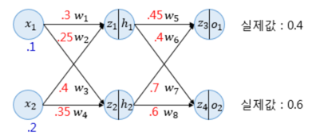
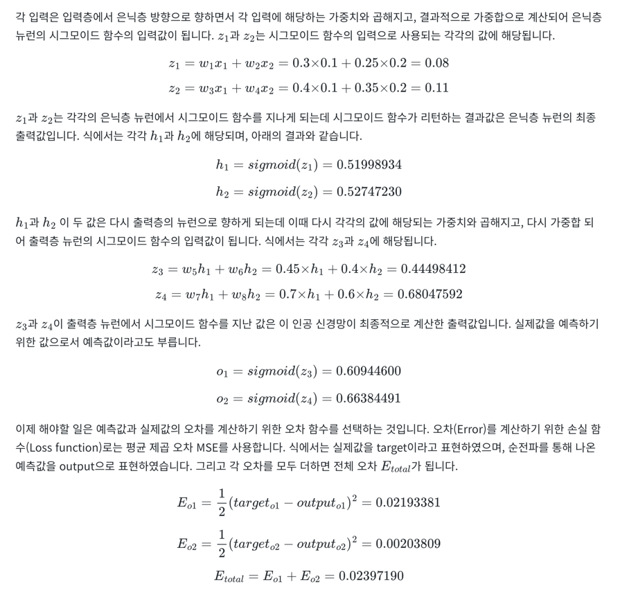
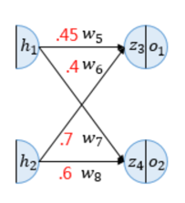
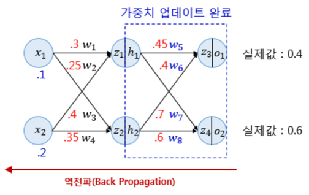
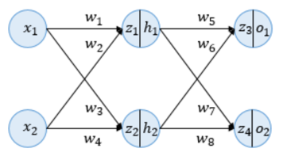

# 1. 인공 신경망의 이해(Neural Network Overview)

- 은닉층과 출력층의 모든 뉴런에서 변수 z가 존재
- 여기서 변수 z는 이전층의 모든 입력이 각각의 가중치와 곱해진 값들이 모두 더해진 가중합을 의미
- 이 값은 뉴런에서 아직 시그모이드 함수를 거치지 않은 상태입니다. 즉, 활성화 함수의 입력을 의미
- 우측의 |를 지나서 존재하는 변수 h 또는 o는 z가 시그모이드 함수를 지난 후의 값으로 각 뉴런의 출력값을 의미
- 역전파 예제에서는 인공 신경망에 존재하는 모든 가중치 w에 대해서 역전파를 통해 업데이트하는 것을 목표

# 2. 순전파(Forward Propagation)

- 위의 그림에서 소수점 앞의 0은 생략
- 파란색 숫자는 입력값을 의미하며, 빨간색 숫자는 각 가중치의 값을 의미
- 위의 그림에 대한 계산은 아래와 같다

# 3. 역전파 1단계(BackPropagation Step 1)
- 순전파가 입력층에서 출력층으로 향한다면 역전파는 반대로 출력층에서 입력층 방향으로 계산하면서 가중치를 업데이트
- 출력층 바로 이전의 은닉층을 N층이라고 하였을 때, 출력층과 N층 사이의 가중치를 업데이트하는 단계를 역전파 1단계
- N층과 N층의 이전층 사이의 가중치를 업데이트 하는 단계를 역전파 2단계

# 4. 역전파 2단계(BackPropagation Step 2)

# 5. 결과 확인

- 순전파로 다시 전달해보니 전체 오차 줄어든다

