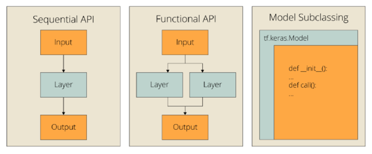

- 케라스의 구현 방식에는 Sequential API, Functional API 외에도 Subclassing API라는 구현 방식이 존재   


# 1. 서브클래싱 API로 구현한 선형 회귀

- Sequential API로 구현했던 선형 회귀를 Subclassing API로 구현한다면 다음과 같다

```python
import tensorflow as tf


class LinearRegression(tf.keras.Model):
  def __init__(self):
    super(LinearRegression, self).__init__()
    self.linear_layer = tf.keras.layers.Dense(1, input_dim=1, activation='linear')

  def call(self, x):
    y_pred = self.linear_layer(x)

    return y_pred

model = LinearRegression()

X = [1, 2, 3, 4, 5, 6, 7, 8, 9] # 공부하는 시간
y = [11, 22, 33, 44, 53, 66, 77, 87, 95] # 각 공부하는 시간에 맵핑되는 성적

sgd = tf.keras.optimizers.SGD(lr=0.01)
model.compile(optimizer=sgd, loss='mse', metrics=['mse'])
model.fit(X, y, epochs=300)
```

# 2. 언제 서브클래싱 API를 써야 할까?

# 3. 세 가지 구현 방식 비교.

## 1) Sequential API
- 장점 : 단순하게 층을 쌓는 방식으로 쉽고 사용하기가 간단
- 단점 : 다수의 입력(multi-input), 다수의 출력(multi-output)을 가진 모델 또는 층 간의 연결(concatenate)이나 덧셈(Add)과 같은 연산을 하는 모델을 구현하기에는 적합하지 않습니다. 이런 모델들의 구현은 Functional API를 사용해야 합니다.

## 2) Functional API
- 장점 : Sequential API로는 구현하기 어려운 복잡한 모델들을 구현 가능
- 단점 : 입력의 크기(shape)를 명시한 입력층(Input layer)을 모델의 앞단에 정의해주어야 합니다. 가령, 아래의 코드를 봅시다.

```python
# 선형 회귀 구현 코드의 일부 발췌

inputs = Input(shape=(1,)) # <-- 해당 부분
output = Dense(1, activation='linear')(inputs)
linear_model = Model(inputs, output)

sgd = optimizers.SGD(lr=0.01)

linear_model.compile(optimizer=sgd, loss='mse', metrics=['mse'])
linear_model.fit(X, y, epochs=300)
```

## 3) Subclassing API
- 장점 : Functional API로도 구현할 수 없는 모델들조차 구현이 가능
- 단점 : 객체 지향 프로그래밍(Object-oriented programming)에 익숙해야 하므로 코드 사용이 가장 까다롭다

